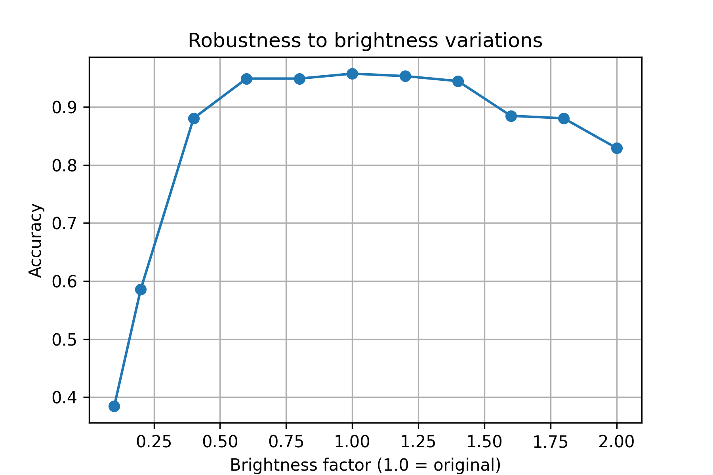
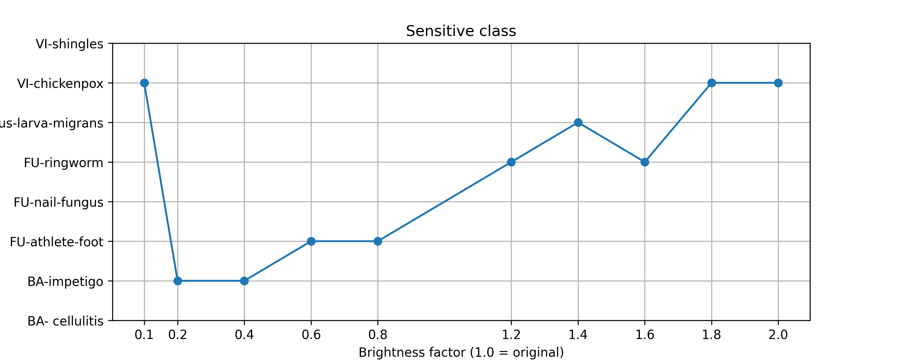
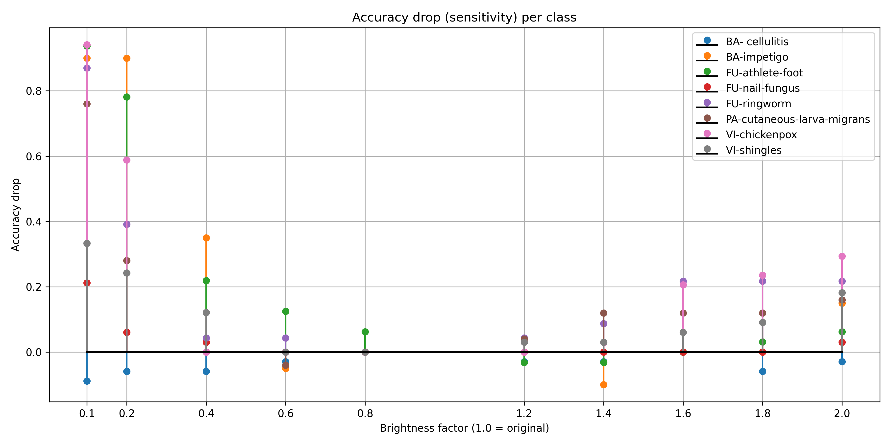

# Skin Detection using Computer Vision

[](https://www.python.org/)
[](https://pytorch.org/)
[](./LICENSE)

Trained a ResNet50-based classifier on skin image classes and evaluate robustness across different brightness levels.

---

## Features

- Dataset loading via `torchvision.datasets.ImageFolder`
- Training + validation split
- Checkpoint save/load (`best_model.pth`)
- Brightness robustness evaluation + JSON export (`brightness_results.json`)
- Plots saved as `.png` files for quick review

---

## Results (repo images)

### Robustness to brightness


### Most sensitive class vs brightness


### Sensitivity across all classes


---

## Setup

Create and activate a virtual environment :

```bash
python -m venv .venv
# Windows:
# .venv\Scripts\activate
# macOS/Linux:
# source .venv/bin/activate
```

Install dependencies:

```bash
pip install torch torchvision matplotlib numpy pillow
```

---

## Run

```bash
python skin_disease.py
```

### Outputs

- `best_model.pth`
- `brightness_results.json`
- `brightness_robustness.png`
- `sensitive_class.png`
- `sensitivity_all_classes.png`

---

## Notes

- Uses GPU automatically if available.
- Validation split is created from the training set inside the script.

---


